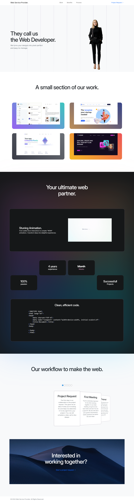

# 🧠 The Amazing Minds – Web Services Provider

A modern, fully responsive website built for **The Amazing Minds**, a creative web services provider agency.  
This project showcases elegant design, interactive animations, and clean, semantic code.

---

## 🌐 Live Preview
**Visit Website:** [Company Website](https://abdullah-akram-developer.github.io/Company-Site/)

---

## 🚀 Features

- ✨ **Modern & Minimalist Design** – Sleek UI with pixel-perfect layout.  
- 📱 **Fully Responsive** – Looks great on all devices and screen sizes.  
- 🧩 **Interactive Sections** – Work showcase, benefits, and workflow carousel.  
- 🎥 **Animated Video Section** – Engaging visual storytelling.  
- 💻 **Clean Code Structure** – Semantic HTML, reusable classes, and efficient components.  
- 🔠 **Google Fonts (Inter)** – For a clean and modern look.

---

## 🛠️ Tech Stack

| Technology | Purpose |
|-------------|----------|
| **HTML5** | Structure and content |
| **CSS3 / Bootstrap 5** | Styling and responsiveness |
| **JavaScript** | Interactivity and carousel functionality |
| **Bootstrap Icons** | Modern icon set |
| **Google Fonts (Inter)** | Typography |

---

## 🧩 Sections Overview

1. **Hero Section** – Introduction with developer branding and image.  
2. **Work Showcase** – Displays selected web design projects.  
3. **Benefits Section** – Highlights experience, animation quality, and project success.  
4. **Code Showcase** – Clean, efficient HTML code sample.  
5. **Workflow Section** – Step-by-step project process carousel.  
6. **Footer** – Contact and project request call-to-action.

---

## 📸 Screenshot

---

## 💬 Contact

📧 **Email:** [Email Me](mailto:m.abdullahakram01@gmail.com)  
🌍 **Website:** [Company Website](https://abdullah-akram-developer.github.io/Company-Site/)

---

## 📄 License

This project is for **personal or educational use only**.  
© 2024 The Amazing Minds. All Rights Reserved.
